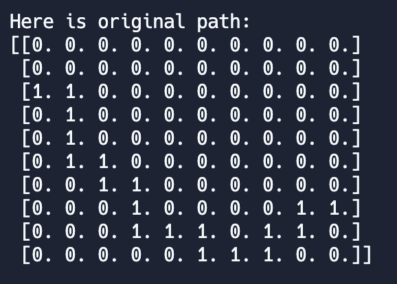

### Instructions

Your task is to navigate through a maze.

The maze is stored in a `.csv` file called `board.csv`. You need to load this file and covert it into a variable in the form of a numpy array (covered below).

You can view the example maze by clicking on `board.csv` (on the file navigator on the left).

You should then write a function that follows the path from left to right through the maze. This function should be called ```choose_move```.

```choose_move``` should take as arguments:
- **board** - the numpy array you loaded from the .csv
- **position** - your current position in the maze, defined as a tuple

Your function ```choose_move``` should output a move that navigates one square - either up, down, left or right. This should be in the form of a tuple (x, y), where:
- up is `(0, 1)`
- down is `(0, -1)`
- right is `(1, 0)`
- left is `(-1, 0)`

You can take any path you like to get to the end, however you will score maximum points if you follow the line of `1`s and do not touch the `0`s.


### Technical details

Your **first task** is to load the csv of the example maze into a numpy array. We've imported ```numpy as np``` at the start of the file.

Your starting position is on the left hand side on the first 1. The path through the maze is defined by 1. During the actual game, the maze path is selected randomly but is always defined by 1s.

Once you move through a square on the path, the square will turn from a 1 to a 2. **Your current position in the map is printed out as 3**

Non-path squares are 0's.

To print out your maze in the console (like below), use `print()` once you've converted it to a numpy array.

Here's an example maze:



### Scoring

Your score will be calculated out of 100.

You get penalised for each step outside of the path.

### Learning resources:
- How to load csvs - Google should help you out here! :)
- Creating a tuple: https://www.programiz.com/python-programming/tuple
- Creating arrays: https://www.w3schools.com/python/numpy/numpy_creating_arrays.asp
