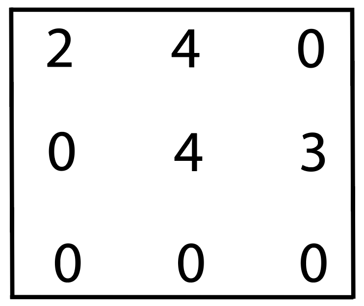
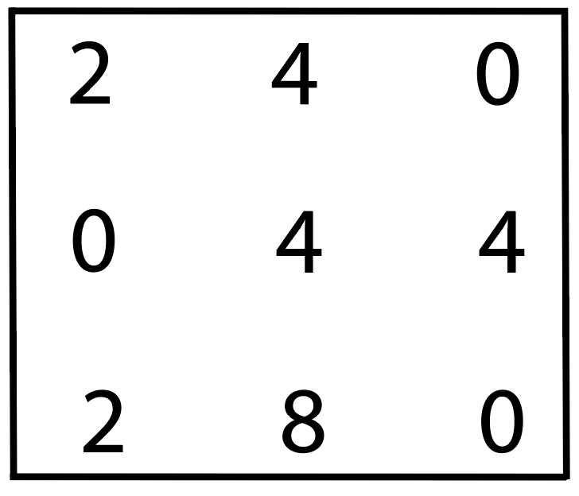
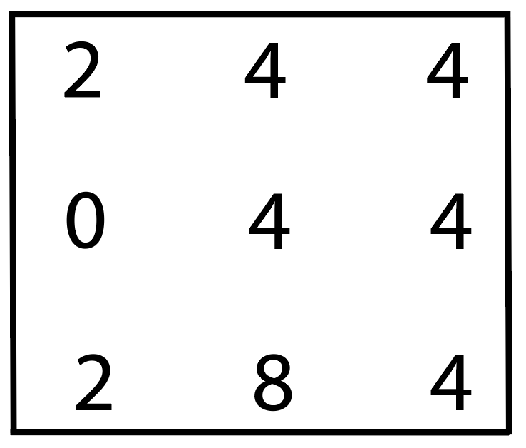

# Merge Gun Madness

Elon's crazy new invention, the **Merge Gun****TM** (*not a flamethrower*) is ready.
Since there'll be no manufacturing on Mars, it'll be useful to create new objects out of those you have too many of.

In his excitement, he's forgotten to let you out of the gravity testing chamber, and is going to test it in there!

Like last time, at the start the room has no gravity, so objects float around.

Then Mr. Musk flicks the gravity switch and watches his **Merge GunTM** automagically shoot at (and merge together) any two identical objects that collide.
When two objects merge, they turn into another object!
All the objects go directly down to the ground and stack if not able to merge.

**What a marvel of physics and engineering!**

To survive, you must predict where objects will be at the end so you can position yourself safely and not be crushed or caught up between two merging objects.

## Instructions

You write the `room_after_gravity_merge()` function.
This should take the array `room` and return the `room` array with the objects in the locations they'll be in after gravity is switched on and objects are merged.

The `room` array is rectangular and takes a random size, with the number of rows and columns taking random values between 5 and 10.

The array is full of zeros (representing empty space), other than the 'objects', which are signified by different numbers `1` to `5`. There are a random number of objects in the room.

The code below the `room_after_gravity_merge()` function is used to run the tests to see if you got it right!

If two objects are identical (e.g. two `4`'s) and would end up on top of each other after gravity has been applied, they merge.
See examples below.

**Each object may only merge once per gravity-switch-flick.**

The objects still stack on top of each other if they do not merge!
If 3 objects of the same type would collide when falling, the bottom 2 merge first (they collide first) then the 3rd stacks on top of the new object.
See 3rd example below if this is unclear.

## Example #1

Here's a simple 3 x 3 example:

Your code, when applied to the example above, should return:

## Example #2

This time, we see 2 merges happen and stacking at the end:

Your code, when applied to the example above, should return:

## Example #3

This time, we see 3 objects of the same type on top and the lower 2 merge, while the 3rd stacks on top:

Your code, when applied to the example above, should return:

